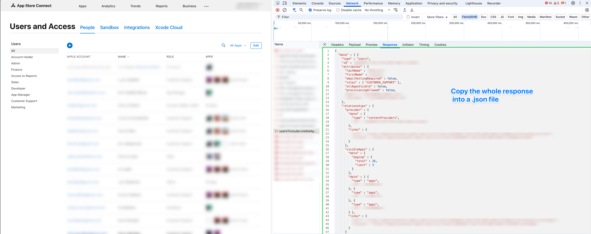

# App Store Connect Access Review Tool

A security-focused tool for analyzing user access and permissions in App Store Connect to identify potential account hijacking risks and organizational takeover vulnerabilities.

## 🛡️ Purpose

This tool helps security teams and administrators:
- **Identify high-risk users** who could cause maximum damage if compromised
- **Detect organizational takeover risks** from users with excessive permissions
- **Review access patterns** across your App Store Connect organization
- **Maintain least-privilege access** by flagging users with unnecessary permissions

## 🚨 Key Risk Indicators

The tool analyzes several critical risk factors:

### 🔴 Critical Risks
- **ADMIN** and **ACCOUNT_HOLDER** roles - Full organizational control
- **allAppsVisible** capability - Complete portfolio visibility
- **provisioningAllowed** capability - Certificate management access

### 🟠 High Risks  
- **APP_MANAGER** role - Can manage app submissions and distribution
- **CLOUD_MANAGED_APP_DISTRIBUTION** role - Enterprise app distribution
- **GENERATE_INDIVIDUAL_KEYS** role - Can create distribution certificates

### 🟡 Elevated Risks
- **ACCESS_TO_REPORTS** role - Financial and analytics access
- **FINANCE** role - Financial data access
- **MARKETING** role - Marketing and promotional capabilities

## 📊 How to Use

### 1. Export Your App Store Connect Users

1. Open **App Store Connect** in your browser
2. Go to **Users and Access** section
3. Open Developer Tools (F12) and go to Network tab
4. Navigate to the users page and look for the API call to:
   ```
   https://appstoreconnect.apple.com/iris/v1/users?include=visibleApps,provider&limit=500&sort=lastName&limit[visibleApps]=3&fields[apps]=&fields[users]=allAppsVisible,email,emailVettingRequired,firstName,lastName,provider,provisioningAllowed,roles,username,visibleApps
   ```
5. Copy the response and save it as a JSON file

Screenshot:


## 📋 Requirements and Installation

- Python 3.7+
- Streamlit
- Pandas

Installation:

1. Clone the repository
```bash
git clone https://github.com/jafar-albadarneh/appstoreconnect-access-review.git
```

2. Install dependencies
```bash
pip install -r requirements.txt
```

## Running the App
### Option 1: Using Streamlit CLI
```bash
streamlit run main.py
```
### Option 2: Using VSCode Play Button

This project includes a pre-configured .vscode/launch.json file. If you open this folder in VSCode, you can simply click the Run/Play button (▶️) at the top right or select "Streamlit: Run main.py" in the Run & Debug panel. This will launch the app with one click—no terminal commands needed!

### 3. Upload and Analyze
1. Select roles to monitor from the Settings page
2. Upload your JSON export file (In the Home page)
3. Review the risk analysis dashboard
4. Focus on users flagged as **CRITICAL** or **HIGH** risk
5. Use the detailed analysis to understand specific risks per user

## ⚙️ Configuration

The tool includes several preset configurations:

- **🔒 Security Focused** (Default): Comprehensive monitoring of dangerous roles
- **📊 Financial Focus**: Focuses on financial and reporting access
- **Custom**: Manually configure which roles to monitor

You can customize which roles are considered dangerous in the Settings page.

## 🛡️ Security Best Practices

1. **Regular Access Reviews**: Run this tool monthly or quarterly
2. **Least Privilege**: Remove unnecessary roles and capabilities
3. **Monitor Changes**: Track when users gain new permissions
4. **Document Justification**: Maintain records of why users need elevated access
5. **Incident Response**: Have procedures for compromised high-risk accounts


## 📝 License

This tool is provided for security and compliance purposes. Use responsibly and in accordance with your organization's security policies.

Created with love by [@jafar-albadarneh](https://github.com/jafar-albadarneh)